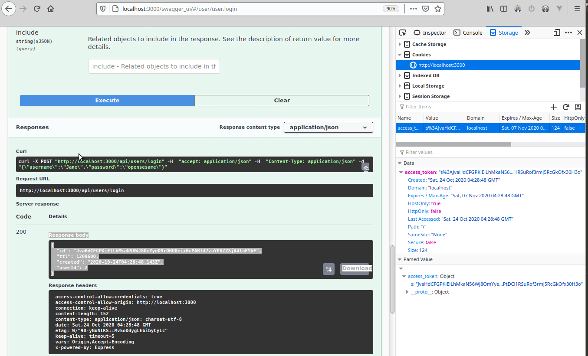

# loopback-swagger-ui4-example

Loopback 3's [explorer component](https://github.com/strongloop/loopback-component-explorer) uses Swagger-UI v2, which
has several security advisories reported such as

- [GitHub advisory CVE-2019-17495](https://github.com/advisories/GHSA-c427-hjc3-wrfw)
- https://www.npmjs.com/advisories/985
- https://www.npmjs.com/advisories/976

There isn't any ongoing effort to adapt newer versions of Swagger-UI to Loopback 3, which is still widely used. This
repo contains an example to replace the default Explorer Component with one usin Swagger-UI v4.


```
$ git clone https://github.com/ffflabs/loopback-swagerUI4-example
$ cd loopback-swagerUI4-example
$ npm install
$ npm start
```

This example uses [Looback Example Access Control](https://github.com/strongloop/loopback-example-access-control) as
a boilerplate app. Said example creates a "Startkicker" app  to demonstrate authentication and
authorization mechanisms in LoopBack. For what matters to this example, it's enough to say we create a
few users on application boot. One of these is

```json
{"username":"Jane", "password": "opensesame"}
```

These credentials will be used to authenticate in the new explorer component.

## Prerequisites

### Install and configure Cookie Parser middleware

1. Install express's cookie parser middleware

```
npm install cookie-parser
```

2. Attach cookie parser as a property of your app instance in [server/server.js](server/server.js)

```
loopback.cookieParser = require('cookie-parser');
```

3. Set a cookie secret on your ['server/config.json'](server/config.json) file:

```
{
  "restApiRoot": "/api",
  "COOKIE_SECRET": "__REPLACE_WITH_PROPER_RANDOM_SECRET__",
  "host": "0.0.0.0",
  ...
}
```

4. Add the cookie parser middleware to your ['server/middleware.json'](server/middleware.json) file,
setting it to use it on the `session:before` stage and with the `COOKIE_SECRET` you defined above

```
"session:before": {
    "loopback#cookieParser": {
      "params": "${COOKIE_SECRET}"
    }
  },
```

### Allow credentials header

5. In ['server/middleware.json'](server/middleware.json) file also, ensure the `cors` middleware is sending the `access-control-allow-credentials` header

```
  "initial": {
    "compression": {},
    "cors": {
      "params": {
        "origin": "http://${host}:${port}",
        "credentials": true, // <----- this one
        "maxAge": 86400
      }
    }
  },
```

### Create the component and enable it

6. Create a ['server/components/swagger-ui.js'](server/components/swagger-ui.js) script (name it whatever you want). The linked example may
be boiled down to:

```js
module.exports = async function (loopbackApp, options = {mountPath: ''}) {
  const swaggerUi = require('swagger-ui-express'),
    createSwaggerObject = require('loopback-swagger').generateSwaggerSpec,
    router = loopbackApp.loopback.Router();

  loopbackApp.use(
    options.mountPath,
    swaggerUi.serve,
    swaggerUi.setup(createSwaggerObject(loopbackApp, options))
  );
  loopbackApp.use(router);

  loopbackApp.set('swager_ui', options);
};
```

7. Then enable the component in ['server/component-config.json'](server/component-config.json)

```json
{
  "./components/swagger_ui": {
    "mountPath": "/swagger_ui"
  }
}
```

You're done.

## Now what?

Start your app using `npm start`. Browse to the url you configured for it. Usually http://localhost:3000

The new explorer is at http://localhost:3000/swagger_ui. Note that there is no token input as the one
in Loopback Component Explorer, and since you are not logged in, trying to get a user's properties
will result in an error:


Use the same explorer to log in as

 ```json
{"username":"Jane", "password": "opensesame"}
```


The cookie parser middleware will set an encrypted cookie that will be passed in your requests from then on




